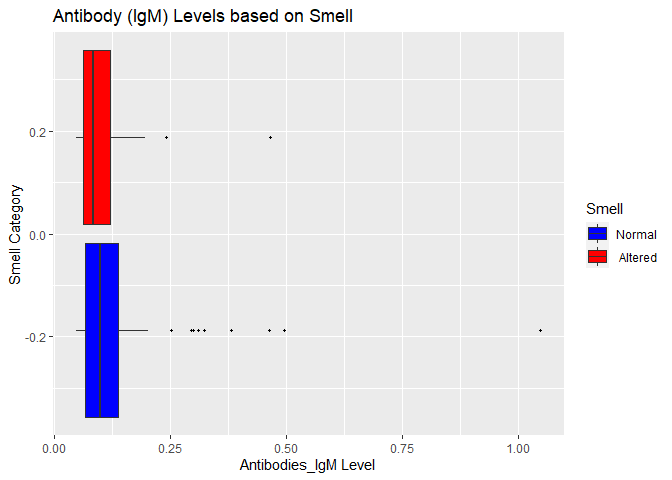

Biostatistical Methods I - HW1
================
JingYao Geng
9/24/2020

## Problem 1

#### 1.1.a: Descriptive Statistics

  - The **Antibodies** data set contains a total of **1491**
    observations and **5** variables.
      - **1224** missing values are founded in variable called
        **Antibody\_IgM**.
      - **34** observations of variable **Smell** are categorized as
        “Unanswered/others”.
      - The rest of variables: **Subject**, **AgeCategory**, and
        **Gender** contain no missing values.
  - The following table shows the **descriptive statistics** for all the
    variable of interest.
      - **Numeric variable: Subject, Antibody\_IgM**
      - **Categorical variable: AgeCategory, Gender, Smell**

<!-- end list -->

    ## 
    ## Table: Descriptive Statistics: Antibodies Data
    ## 
    ## |                     |       Overall (N=1491)       |
    ## |:--------------------|:----------------------------:|
    ## |Subject              |                              |
    ## |-  Mean (SD)         |      1413.751 (881.073)      |
    ## |-  Median (Q1, Q3)   | 1373.000 (632.500, 2190.500) |
    ## |-  Min - Max         |       1.000 - 2917.000       |
    ## |-  Missing           |              0               |
    ## |Antibody(IgM)        |                              |
    ## |-  Mean (SD)         |        0.124 (0.110)         |
    ## |-  Median (Q1, Q3)   |     0.091 (0.069, 0.129)     |
    ## |-  Min - Max         |        0.048 - 1.048         |
    ## |-  Missing           |             1224             |
    ## |Age                  |                              |
    ## |-  18-30             |         318 (21.3%)          |
    ## |-  31-50             |         810 (54.3%)          |
    ## |-  51+               |         363 (24.3%)          |
    ## |-  Missing           |              0               |
    ## |Smell                |                              |
    ## |-  Altered           |         1047 (70.2%)         |
    ## |-  Normal            |         410 (27.5%)          |
    ## |-  Unanswered/Others |          34 (2.3%)           |
    ## |-  Missing           |              0               |
    ## |Gender               |                              |
    ## |-  Female            |         981 (65.8%)          |
    ## |-  Male              |         510 (34.2%)          |
    ## |-  Missing           |              0               |

#### 1.1.b: Histogram for the Ig\_M values

The histogram of Antibody\_IgM shows a right skewed distribution, where
the mean of the Antibodies\_IgM level tends to be ‘pulled’ toward the
right tail of the distribution.

<!-- -->

#### 1.2.a: Descriptive Statistics Stratified by Smell

  - There are more observations in the Altered collection of Smell,
    regardless the variable Age, Gender, and Antibody\_IgM.
  - The normal group of Semll is more evenly distributed in gender than
    the altered group.
  - Age range 31-50 contributes more than 50% of the observations in
    both normal and altered groups.

<!-- end list -->

    ## 
    ## Table: Descriptive Statistics Stratified by Smell
    ## 
    ## |                   |   Altered (N=519)    |    Normal (N=202)    |
    ## |:------------------|:--------------------:|:--------------------:|
    ## |Age                |                      |                      |
    ## |-  18-30           |     117 (22.5%)      |      33 (16.3%)      |
    ## |-  31-50           |     278 (53.6%)      |     106 (52.5%)      |
    ## |-  51+             |     124 (23.9%)      |      63 (31.2%)      |
    ## |-  Missing         |          0           |          0           |
    ## |Gender             |                      |                      |
    ## |-  Female          |     369 (71.1%)      |     119 (58.9%)      |
    ## |-  Male            |     150 (28.9%)      |      83 (41.1%)      |
    ## |-  Missing         |          0           |          0           |
    ## |Antibody(IgM)      |                      |                      |
    ## |-  Mean (SD)       |    0.131 (0.128)     |    0.111 (0.078)     |
    ## |-  Median (Q1, Q3) | 0.098 (0.067, 0.139) | 0.084 (0.064, 0.121) |
    ## |-  Min - Max       |    0.048 - 1.048     |    0.048 - 0.465     |
    ## |-  Missing         |         427          |         166          |

#### 1.2.b: Group Boxplots and Side-by-side Histogram

**Boxplots**:

<!-- -->

    ## List of 2
    ##  $ legend.title   : list()
    ##   ..- attr(*, "class")= chr [1:2] "element_blank" "element"
    ##  $ legend.position: chr "right"
    ##  - attr(*, "class")= chr [1:2] "theme" "gg"
    ##  - attr(*, "complete")= logi FALSE
    ##  - attr(*, "validate")= logi TRUE

  - Both normal and altered boxes contain missing values.
  - The mean of normal group is slightly higher than the altered group.
  - The range of both groups are overlapped a lot.

**Histogram**:

<!-- -->

  - Both Altered and Normal groups display a right skewed distribution
    overall. With the increase of Antibody\_IgM level, the number of
    observations decrease for both groups.
  - There are more observations in the altered group.
