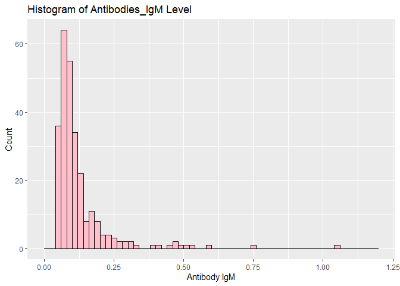

Biostatistical Methods I - HW1
================
JingYao Geng
9/24/2020

``` r
# Clean all objects from the current workspace (R memory) 
rm(list = ls())

# load library
library(arsenal)
library(dplyr)
library(ggplot2)
library(tidyverse)
```

## Problem 1

``` r
# Import data
Antibodies = read_csv(file = "./Antibodies.csv")
```

#### 1\. a) Descriptive Statistics:

  - The **Antibodies** data set contains a total of **1491**
    observations and **5** variables.
      - **1224** missing values are founded in variable called
        **Antibody\_IgM**.
      - **34** observations of variable **Smell** are categorized as
        “Unanswered/others”.
      - The rest of variables: **Subject**, **AgeCategory**, and
        **Gender** contain no missing values.
  - The following table shows the **descriptive statistics** for all the
    variable of interest.
      - **Numeric variable: Subject, Antibody\_IgM**
      - **Categorical variable: AgeCategory, Gender, Smell**

<!-- end list -->

``` r
# Change variable names/labels
my_labels <- list(AgeCategory = "Age", Antibody_IgM = "Antibody(IgM)", Smell = "Smell", Gender = "Gender")

# Clean the output
my_controls <- tableby.control(
  total = T,
  test = F,  # No test p-values yet
  numeric.stats = c("meansd", "medianq1q3", "range", "Nmiss2"),
  cat.stats = c("countpct", "Nmiss2"), 
  stats.labels = list(
    meansd = "Mean (SD)",
    medianq1q3 = "Median (Q1, Q3)",
    range = "Min - Max",
    Nmiss2 = "Missing",
    countpct = "N (%)"))

tab1 <- tableby( ~ Subject + Antibody_IgM + AgeCategory + Smell + Gender, data = Antibodies, control = my_controls)

#Descriptive Statistics:
summary(tab1, title = "Descriptive Statistics: Antibodies Data", text = T, labelTranslations = my_labels)
```

    ## 
    ## Table: Descriptive Statistics: Antibodies Data
    ## 
    ## |                     |       Overall (N=1491)       |
    ## |:--------------------|:----------------------------:|
    ## |Subject              |                              |
    ## |-  Mean (SD)         |      1413.751 (881.073)      |
    ## |-  Median (Q1, Q3)   | 1373.000 (632.500, 2190.500) |
    ## |-  Min - Max         |       1.000 - 2917.000       |
    ## |-  Missing           |              0               |
    ## |Antibody(IgM)        |                              |
    ## |-  Mean (SD)         |        0.124 (0.110)         |
    ## |-  Median (Q1, Q3)   |     0.091 (0.069, 0.129)     |
    ## |-  Min - Max         |        0.048 - 1.048         |
    ## |-  Missing           |             1224             |
    ## |Age                  |                              |
    ## |-  18-30             |         318 (21.3%)          |
    ## |-  31-50             |         810 (54.3%)          |
    ## |-  51+               |         363 (24.3%)          |
    ## |-  Missing           |              0               |
    ## |Smell                |                              |
    ## |-  Altered           |         1047 (70.2%)         |
    ## |-  Normal            |         410 (27.5%)          |
    ## |-  Unanswered/Others |          34 (2.3%)           |
    ## |-  Missing           |              0               |
    ## |Gender               |                              |
    ## |-  Female            |         981 (65.8%)          |
    ## |-  Male              |         510 (34.2%)          |
    ## |-  Missing           |              0               |

#### 1\. b) Histgram for the Ig\_M values

The histgram of Antibody\_IgM shows a right skewed distribution, where
the mean of the Antibodies\_IgM level tends to be ‘pulled’ toward the
right tail of the distribution.

``` r
# Choose the number of bars/breaks to use for the histogram

min(Antibodies$Antibody_IgM, na.rm = TRUE) # 0.048
## [1] 0.048
max(Antibodies$Antibody_IgM, na.rm = TRUE) #1.0475
## [1] 1.0475
```

``` r
# the shape of Ig_M values looks like a reight-skewd distribution
ggplot(Antibodies, aes(x = Antibody_IgM)) +
  geom_histogram(col = "black", fill = "pink", breaks = seq(0.00,1.20, 0.02)) +                      
  #geom_vline(aes(xintercept = mean(Antibodies$Antibodies_IgM, na.rm = T)), color = "red", linetype = "dashed", size = 2) +  
  labs(title = "Histogram of Antibodies_IgM Level") +                                              
  labs(x = "Antibody IgM", y = "Count")
```

    ## Warning: Removed 1224 rows containing non-finite values (stat_bin).

<!-- -->

## Problem 2

#### 2\. a)

#### 2\. b)
